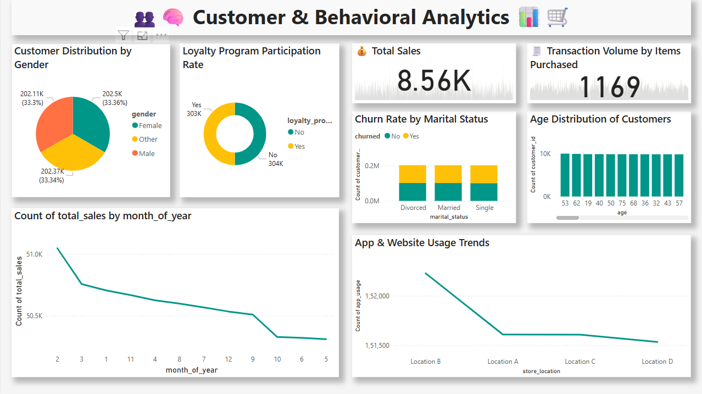
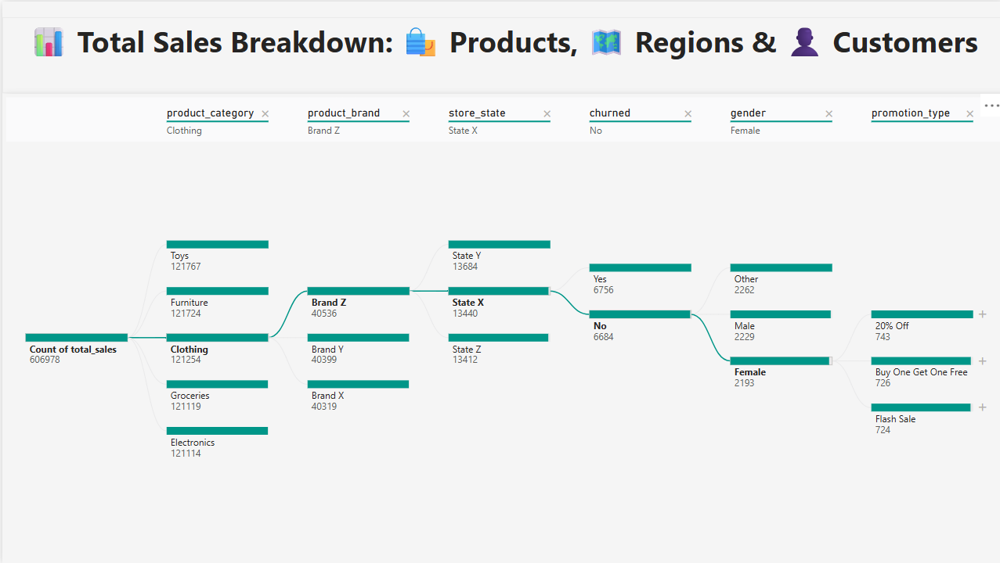
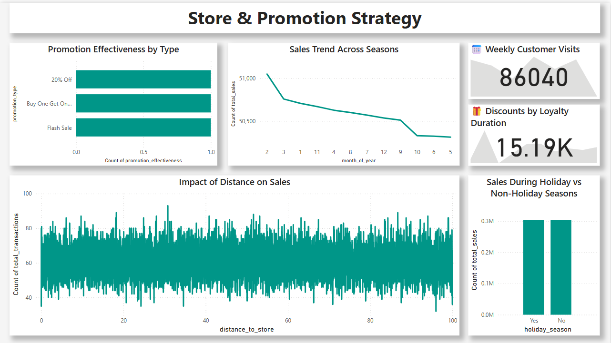

# Retail Data Analysis & Visualization Project

## Overview

This project focuses on analyzing and visualizing retail data using a combination of SQL, Python (Jupyter Notebook), and Power BI. It covers data extraction, transformation, exploration, and the creation of interactive dashboards to derive actionable insights.

## Dataset

- Source: [Large Retail Dataset for EDA (Kaggle)](https://www.kaggle.com/datasets/utkalk/large-retail-data-set-for-eda)

## Project Structure

## Objectives

- Perform data cleaning and exploration on a large retail dataset.
- Use SQL for querying and preparing data for analysis.
- Create visualizations and KPIs to highlight key business insights.
- Build a Power BI dashboard to present findings in an interactive format.

## Contents

### 🔍 Jupyter Notebook (`.ipynb`)

- Initial exploration of the dataset
- Data cleaning and feature engineering
- Exploratory data analysis using Python libraries

### 🗃️ SQL Queries (`.sql`)

- Data extraction and transformation logic
- Aggregations, joins, and filters to prepare data for reporting

### 📊 Power BI Report

- **Download the dashboard** from the link below:
  👉 [Google Drive - Power BI Dashboard](https://drive.google.com/file/d/1nk_jAQ0lVvK1BJd_pR1v2v9DXFYdmcLO/view?usp=sharing)

  **Important:** Google Drive preview might not work for `.pbix` files.  
  To open the dashboard:
  1. Click the link above.
  2. Click the **Download** button (top-right corner).
  3. Open the downloaded file using **Power BI Desktop**.

## Tools Used

- **Python** (Jupyter Notebook)
- **SQL**
- **Power BI**

## How to Use

1. **SQL Setup:**
   - Run `data_queries.sql` against your SQL environment to prepare the dataset.

2. **Jupyter Notebook:**
   - Open `data_analysis.ipynb` in Jupyter to view data cleaning, EDA, and transformations.

3. **Power BI:**
   - Download and open the `.pbix` dashboard from the [Google Drive link](https://drive.google.com/file/d/1nk_jAQ0lVvK1BJd_pR1v2v9DXFYdmcLO/view?usp=sharing) using Power BI Desktop.

# Sales Analysis Dashboard

This dashboard provides insights into customer performance, regional sales trends, and product profitability using Superstore dataset visualizations.

## 🔝 Top Customers

## 🌍 Sales and Profit by Segment and Region

## 📦 Sales and Profit by Sub-Category

## 📊 Sales vs Profit Analysis

---

### 📌 Insights Summary

- **Top Customers**: Focus marketing and loyalty programs on high-value individuals.
- **Regional Analysis**: Tailor strategies based on which segments succeed where.
- **Product Analysis**: Optimize pricing or remove low-profit sub-categories.
- **Profitability View**: Watch for sales-heavy but profit-weak products.

---
## License

This project is intended for educational and portfolio demonstration purposes.
